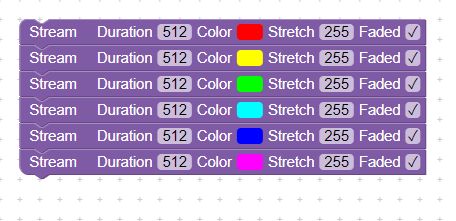

# Color Node

Seminární práce třetího ročníku, doufám že najdu čas a chuť tento projekt rozšířit. Myšlenka je malé, levné konfigurovatelné zařízení na ovládání adresovatelných led pásků,
Fungující jako tlačítko. Jednotlivé zařízení (alias Node) mají možnost mezi sebou komunikovat tím pádem stisknutí tlačítka (event) na jednom zařízení může změnit barvu druhého
(dákový ovladać, wireless schodičový vypínač).

## Používání

Zařízení má 3 eventy. Stisk, dvojtej stisk a podržení (1s). Při každém eventu se na pásku začne vykreslovat nějaká animace kterou si lze nakonfigurovat.

Pro nakonfigurování zařízení udělejte dlouhý stisk(10s). Zařízení na sobě spustí softAP na které se lze připojit (přihlašovací údaje jsou v `firmware/lib/webserver/webserver.h`).


Zároveň na sobě spustí webserver, IP adresa je 192.168.4.1 Stačí jít do prohlížeče.


Až se plocha načte, máme ve vrchní liště dvě tlačítka.
Tlačítko Close Webser vypne softAP, webserver a ukkončí knfigurační mód.
Tlačíkto Upload nahraje aktuální konfiguraci.

Pod horní lištou máme workspace. zde můžeme upravovap připojovat a odpojovat jednotlivé bloky. Pro přidání bloku ho přetáhneme z listu na levé straně. Pro odebrání ho přesuneme na lištu.

Jak přesně nastavení funguje je [tady](#způsob-vykreslování-animací)


## TODO

- [X] rozchodit tlačítko close
- [X] při spuštění automaticky načíst aktuální konfiguraci
- [ ] udělat nový PCB na esp32 pico d4 (testování WIP)
- [ ] předělat do FreeRTOS
- [ ] při zápornýmu stretchi vykreslit z druhé strany, při záporným čase vykresli obráceně
- [ ] umožnit ovládání ostatních node na jedné síti pomocí esp-now
- [ ] udělat něco jako switch case aby jednotlivé eventy mohly fungovat jako přepínač
- [ ] předdefinované animace
- [ ] zbavit se FastLEDu

## Obsah
1.  [PCB/DPS](#pcb/dps)
    * [Design](#design)
    * [Chyby](#chyby)
    * [ESP8266](#esp8266)
3. [Použité knihovny](#použité-knihovny)
    * [FastLED](#fastled)
    * [PlatformIO](#platformio)
        * [Arduino](#arduino)
        * [LittleFS](#littlefs)
        * [ESP8266WiFi](#esp8266wifi)
        * [ESP8266WebServer](#esp8266webserver)
        * [ESP8266mDNS](#esp8266mdns)
    * [Vlastní](#vlastní)
        * [touch](#touch)
        * [webserver](#webserver)
        * [colorengine](#colorengine)
    * [Google Blockly](#google-blockly)
5. [Způsob vykreslování animací](#způsob-vykreslování-animací)
    * [Princip](#princip)
    * [Výhody/Nevýhody](#výhody/nevýhody)
    * [Příklady](#příklady)
6. [Programování](#programování)
    * [Postup](#postup)
    * [Nastavení](#nastavení)
---

# PCB/DPS

## Design

Celý plošný spoj je prakticky jednostranný, sice má dvě vrstvy ale druhá se používá jako kapacitní senzor (je tam na to čip TPP223E), takže je možnost si plošnák doma vyleptat.
Na druhé straně pak je samotný modul s UART převodníkem, EEPROMkou a konektorama.

Další krok bude místo modulu tam dát ESP32-PICO-D4 což je SoC od Esspriffu který v sobě má 4MB flash, Má dvě jádra na až 240MHz, touch sensor má v sobě zabudovaný, má navíc bluetooh a umí toho spoustu dalšího.

## Chyby

- Obsahuje starý název RGBase (tak se projet původně jmenoval)
- LED dioda je technicky zbytečná, může se odstranit
- EEPROM je taky zbytečná, zapisuji do přímo do flash modulu pomocí vnitřního filesystému
- Rezistory R7, R8 jsou zbytečné
- Enable u LDO můžeme připnout k Enable ESP8266
- Lepší konektory
- Potřeba vyřešit VCC a GND led pásku, nemůže napájet moc dlouhé led pásky
- UART převodník zbytečný, slouží jen k programování

## ESP8266

Obecně firma Esspriff dělá velice dobré procesory s mnoha periferiema za dost levnou cenu.
Mají výbornou dokumentaci a všude je spousta návodů a je více způsobů jak procesor programovat,
a jediné co vám k tomu stačí je UART převodník.

To co jsem použil v designu není ale jejich procesor ale modul. Procesor jako takový nemá nějaké externí komponenty, jako anténu, krystal,
kondíky apod. Modul co jsem použil se jmenuje ESP8266MOD nebo taky ESP12-F od firmy Ai-Thinker (datasheet [zde](https://docs.ai-thinker.com/_media/esp8266/docs/esp-12f_product_specification_en.pdf)).
Obsahuje 4MB SPI flash která dosáhne až 80Mhz. Je jedno který modul se použije, flash vždy jde programovat přes uart (pomocí esptool).

Já jsem pro programování nakonec použil PlatformIO což je extension to VS Code. Jednotlivé api se trochu liší ale celkově jsou podobné.
Obsahuje Arduino Core což umožňuje ovládat piny pomocí předdefinovaných funkcí a další věci (materiály [zde](https://docs.platformio.org/en/latest/platforms/espressif8266.html), [zde](https://www.espressif.com/sites/default/files/documentation/esp8266-technical_reference_en.pdf) a [zde](https://www.espressif.com/sites/default/files/documentation/2c-esp8266_non_os_sdk_api_reference_en.pdf)).

# Použité knihovny

## FastLED

FastLED je Arduino knihovna která umožňuje ovládat adresovatelné led pásky ze všech možných procesorů, které Arduino podporuje. Je speciálně optimalizovaná právě pro ESP8266 a ESP32.

Funguje tak že vytvoří buffer do kterého můžete zapisovat barvy po kanálech RGB, má i barvy předdefinované a podporuje velkou škálu pásků (více [zde](https://github.com/FastLED/FastLED)).

Dokonce jsem napsal cheat který umožňuje ovládat RGBW pásky SK6812 ([tady](https://github.com/arnytrty/FastLED)).

## PlatformIO

PlatformIO je extension do VS Code který umožnuje programovat procesory nejrůznějších typů v jednom prostředí a s několika API - já jsem si vybral Arduino Core, protože jsem se znažil to napsat v RTOSu od Espriffu, ale narazil jsem na bug v jejich novém kódu a nebyl jsem schopnej ho zpravit.

PlatformIO mi dalo přístup jak k oficiálním knihovnám pro ESP8266 tak i Arduinu a jejich komunitním knihovnám.

### Arduino

Arduino je API které přidává set jednoduchých funkcí na ovládání procesoru jako například nastavení pinu, čtení hodnot, Stringy, apod.. (jsou to vlastně makra).

Vice [zde](https://www.arduino.cc/reference/en/).

### LittleFS

Knihovna přímo pro ESP8266 - součástí PlatformIO. Dokáže část flashe přiřadit filesystému do kterého můžeme zapisovat, číst, prožkoumávat pomocí C/C++ funkcí, popřípadě ho předem naprogramovat.

Má ale jednu malou nevýhodu, více v sekci [tady](#google-blockly).

### ESP8266WiFi

Součást Arduina pro ESP8266 na ovládání WiFi. Umožnuje se připojit nebo vytvořit softAP. atd.

### ESP8266WebServer

Součást Arduina pro ESP8266. Umožňuje vytvořit jednoduchý webserver a ovládat ho.

### ESP8266mDNS

Součást Arduina pro ESP8266. Dokáže vytvořit DNS server apřiřadit mu adresy.

## Vlastní

Tyhle jsem napsal já. Celá dokumentace v kódu.

### touch

Tato knihovna automaticky detekuje předem definovaný pin a dokáže rozpoznat mezi stisknutím, dvojtým stisknutím,
krátkým a dlouhým podržením. Nastavíte jí callbacky které pak zavolá a jediné co musíte udělat je jí pravidelně volat v loopu.

### webserver

Toto dokáže zapnout/vypnout konfigurační webserver a softAP. SoftAP můžete nastavit jméno a heslo, dokonce to mělo mít i mDNS ale tu jsem ještě nerozchodil. Webserver je jednoduchý, napsal jsem si vlastní address handler kterým jsem propojil složku `data/www`.
Bohužel neumí php requesty, nebo jsem minimálně nenašel jak, takže data posílám přes adrey.

Při programování jsem zjistil že soubory mají nějakou maximální velikost, což jsem vyřešil [tady](#google-blockly).

### colorengine

Toto zařizuje vykreslování animací za pásek,stará se to o jejich pořadí, časy, a lineární transition.

Jak animace fungují je popsáno v sekci [tady](#způsob-vykreslování-animací).

## Google Blockly

Google Blockly je javascriptová knihovna která umožňuje intuitivní programování online (neboli blokové programování).
Můžete si vytvořit vlastní bloky a pravidla jak je k sobě připojovat a napsat si vlastní způsob,
jak data budou interpretována. Díky tomu jsem byl schopen udělat jednuduché prostředí kde zařízení konfigurovat.

Při nahrávání do [filesytém](#littlefs) jsem ale zjistil že `blockly.min.js` je moc velké.
Maximální velikost souboru je zhruba 50KB a blockly mělo 800KB. Rozsekal jsem proto blockly na menší díly,
které si prohlížeč na konci spojí, a spustí ve správném pořadí. Je to taky důvod proč při spuštění
webové strány to píše loading blockly part...


Více [zde](https://developers.google.com/blockly).

# Způsob vykreslování animací

## Princip

Celý princip je založený na tom, jak adresovatelné pásky fungujou. Daly by se přirovnat k shift registrům zapisujeme data do první ledky, a ty se postupně přesunou do druhé, do třetí, do čtvrté...

Každá část animace(budu referovat jako stream) má čtyři proměnné
* Color(Barva)
* Duration(Čas)
* Stretch(kolik ledek to vykreslí)
* Faded(jestli má udělat přechod)

Celý funkčnost enginu se dá vyjádřit takto:
*Vykresli X ledek v čase T o barvě C* s tím že vykresli opravdu znamená vykresli když je faded vypnutý,
nebo udělej transition pokud je zapnutý. Můžeme si udělat takovýhle scénář:

Náš pásek vypadá nějak takto (data pin mám připojený vpravo) a máme vykonat tento blok


Věta pro colorengine by teda byla: *Vykresli 10 ledek v čase 500ms barvou červenou bez přechodu*. Tím pádem každých 50ms to vykreslí jednu ledku vpravo a posune původní data o ledku vedle. Nakonec po dokončení streamu pásek tedy bude vypadat takhle:


Pokud bychom zašktrli faded tak by to každých 50ms vykreslilo ledku stejně jako předtím, ale místo vykreslení rouvnou červené to postupně vykreslí přechod s tím že poslední ledka bude červená:


## Výhody/Nevýhody

Výhody
* Celkem rychlé na výpočty, málo zatížení na procesor
* Jednoduché na pochopení
* Možnost udělat bez FastLEDu
* Dostačující

Nevýhody
* Animace jen těžce můžou jezdit pozpátku
* Omezená možnost animací

## Příklady

Tento stream instantně překleslí celej pásek černou (vypne ledky)


Streamy se dělají postupně, takže nejdřív to přechodem vykreslí červenou, přes červenou zelenou, přes zelenou modrou a pak se to opakuje.
Takže to udělá duhu. Cyklus duhy bude 512ms * 3. Když chceme více barev můžeme přidat mezibarvy




Toto nejdřív vykreslí 6 ledek ničím, potom 6 ledek s přechodem do bíle a 6 ledek s přechodem do ničeho.
Tudíž to udělá něco jako výstřel a bude se opakovat každých 6 * 3 ledek.


Jednotlivé streamy dávámě pod eventy. Když si vezmeme následující pobrázek, při stisknutí to začne vykreslovat duhu. Při dvojstisku to začne vykreslovat výstřely a při podržení to pásek vymaže.


# Programování

## Popis
Pro programování potřebujete PlatformIO extension do VS Code. Pro nové instsalace se musí vytvořit nový projet aby si PlatformIO stáho potřebné knihovny.
Board je ESP12-F a platforma je Arduino. Nasledovně můžete projekt smazat a otevřit pomocí
VS Code složku firmware. PlatformIO se automaticky načte a nastaví compiler.

Potom stačí připojit zařízení a na dolní liště pustit upload. Následovně je potřeba otevřit PIO CLI(taky na dolní liště) a napsat příkaz `pio run -t uploadfs`. Tento příkaz zkomprimuje a uploadne složku data do modulu do jeho filesystému, více níže. A to je celé..

## Nastavení
Jak jsem se zmíníl výše zařizení má 4MB flash a z toho můžeme nějakou část přidělit [filesystému](#littlefs).
Já jsem procesor rozdělil na dvě půlky, kde 2MB je C/C++ kód a druhá půlka je pro filesystém.
Stačilo do configu `platformio.ini` přidat:
```
board_build.filesystem = littlefs
board_build.ldscript = eagle.flash.4m2m.ld
```

Normálně esp8266 používá SPIFFS což je od esspriffu, ale je to celkem zastaralé, proto jsem se přesunul do LittleFS který je vyvíjen komunitou (více [zde](https://arduino-esp8266.readthedocs.io/en/latest/filesystem.html#filesystem)).

U filesystému jsem narazil ještě na jednu chybu kterou jsem popsal u [Google Blockly](#google-blockly)